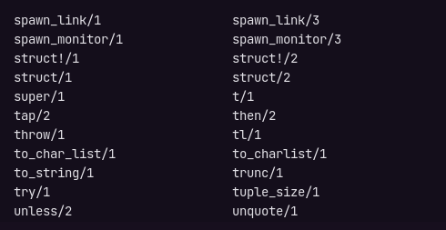

# IEX

Com o Elixir já instalado, podemos rodar o comando `iex` no terminal e iniciar o Elixir Interativo, funciona de forma parecida com o _Node.js_, neste caso o IEX nos permite rodar código Elixir no próprio terminal.

No início do curso utilizaremos o IEX para testar alguns códigos, antes de fazer um projeto completo com arquivos em uma IDE.

Execute uma operação simples para testar o IEX:

```erl
1 + 1
```

Ao digitar o comando `h` seguido de algum termo válido da linguagem, o IEX exibirá um texto de ajuda com sobre o termo buscado, exemplo:

```erl
h String
```

O IEX tabém exibe uma documentação com exemplos para métodos específicos como por exemplo:

```erl
h String.slice
```

Digitando `String.` no terminal, podemos visualizar todas os métodos disponíveis para o módulo String (talvez tenha digitar `tab` para poder ver).

Ao digitar `Kernel.`, serão exibidas no temrinal, as funções embutidas do Elixir que podemos utilizar diretamente sem precisar se preocupar com módulos.

Repare que quando visualizamos os métodos disponíveis, existe uma barra e um número ao lado deles, isso representa o numero de argumentos que um método recebe:


