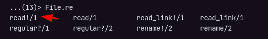
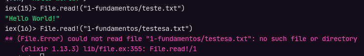

# Tuplas

As Tuplas (`Tuple`) são coleções que possuem um número fixo de elementos, diferente de [List](listas.md), as Tuplas possuem seus elementos contidos em um endereço de memória.

Para criar uma tupla, ao invés de colchetes, utilize chaves `{}`:

```elixir
myTuple = {"Jonatas", 23, :ok}
# {"Jonatas", 23, :ok}
```

Como os elementos estão contidos em memória então é possível acessá-los diratamente através do seu índice, utilizando o método `elem()`, por exemplo:

```elixir
elem(myTuple, 0)
"Jonatas"

elem(myTuple, 1)
# 23

elem(myTuple, 2)
# :ok
```

Enquanto as lista são normalmente utilizadas para realizar operações sobre dados vindos de API's como: percorrer listas de produtos, clientes, etc, as Tuplas normalmente são utilizadas para servir como estruturas de dados pré definidas.

Um exemplo da utilização de Tuplas está no método de leitura de arquivos `File.read()`, no ditetório deste artigo tem um arquivo de texto de teste chamado `teste.txt`, para ler basta rodar o comando:

```elixir
File.read("1-fundamentos/teste.txt")
# {:ok, "Hello World!"}
```

Note que o retorno deste método sempre vem em forma de Tupla, sendo que no primeiro elemento temos um Atom indicando se deu certo ou erro, e no segundo elemento virá o texto do arquivo ou uma mensagem de erro, teste agora em um arquivo que não existe:

```elixir
File.read("testeerror.txt")
# {:error, :enoent}
```

## Dica

Alguns métodos como `File.read()`, podem ter uma variação com um sinal de exclamação (!) que é chamado de "_Bang_", começe a digitar `File.re` e use a tecla `Tab` para obter dicas do método, será possível ver essa variação:



A diferença do método bang para o outro, é que no método bang, se não houver um arquivo a ser lido ao invés de exibir a mensagem com erro em forma de Tupla, o Elixir lançará uma excessão e se tiver valor será devolvido direto como uma string mesmo:



## Referências

- [Tuple](https://hexdocs.pm/elixir/1.13.3/Tuple.html)
- [Collections](https://elixirschool.com/pt/lessons/basics/collections/)
