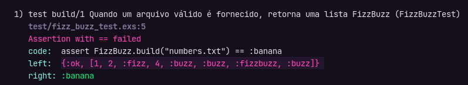

# Testando o Projeto

Ao criar um projeto com `mix`, o diretório `test` é criado com o arquivo de teste para módulo de exemplo correspondente, a convenção de nome de arquivo de teste é: `module_name_test.exs`.

Limpe o arquivo de teste e deixe apenas com `ExUnit.Case`:

```elixir
defmodule FizzBuzzTest do
  use ExUnit.Case
end
```

Vamo utilizar o método `describe()` para testar nossa unica função pública, a `build()`, e essa função possui apenas 2 cenários, um onde a leitura do arquivo é feita com sucesso e outro quando houver erro na leitura.

Por questão de boa prática podemos nomer o `describe` como o nome da função e mais a sua aridade, e o nome do teste com uma frase descritiva:

```elixir
defmodule FizzBuzzTest do
  use ExUnit.Case

  describe "build/1" do
    test "Quando um arquivo válido é fornecido, retorna uma lista FizzBuzz" do
  end
end
```

O método `assert` pode ser utilizado para validar a nossa função, neste caso vamos comparar o retorno com um Atom propositalmente errado chamado `:banana`, só para ver o retorno, rode o comando `mix test`:



Repare que o teste obviamente irá falhar porém ele vai apresentar na propriedade `left`, o retorno que ele esperava, logo podemos copiar isso e usar na nossa comparação:

```elixir
defmodule FizzBuzzTest do
  use ExUnit.Case

  describe "build/1" do
    test "Quando um arquivo válido é fornecido, retorna uma lista FizzBuzz" do
      expected_response = {:ok, [1, 2, :fizz, 4, :buzz, :buzz, :fizzbuzz, :buzz]}
      assert FizzBuzz.build("numbers.txt") == expected_response
    end
  end
end
```

A mesma lógica pode ser usada para o teste de erro, porém ao invés de esperar o retorno da lista, esperamos o retorno da tupla de erro:

```elixir
test "Quando um arquivo inválido é fornecido, retorna mensagem de erro" do
  expected_response = {:error, "Erro ao ler o arquivo: enoent"}
  assert FizzBuzz.build("invalid.txt") == expected_response
end
```

## Dica

Ao terminar o código, caso sua IDE não possua extensão/plugin para formatar o código, você pode utilizar o comando `mix format` para formatá-lo.
