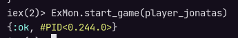
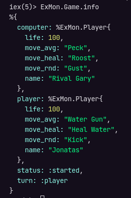

# Armazenando estados com Agent

O Jogo possui um estado que pode ser alterado de diversas formas:

- O jogo iniciou? está acontecendo? ou já terminou?
- De qual player é o turno atual?
- Quais são os jogadores e qual status de cada um ao decorrer dos turnos?

Para armazenar informações de estado poderiamos até utilizar um `map`, porém como faremos para alterar ele toda rodada? ir modificando em memória? onde este map seria criado? seria criado como uma variável global?

Nesse tipo de situação o `Agent` entra como uma solução para armazenar estados de forma fácil mantendo o conceito de imutabilidade da programação funcional.

## Como funciona um Agent?

No exemplo da documentação oficial temos um contador e nele existem 3 métodos:

1. `start_link()`: Método com valor inicial do Agent.
2. `value()`: Método que retorna o valor atual do Agent.
3. `increment()`: Método que modifica o Agent.

```elixir
defmodule Counter do
  use Agent

  def start_link(initial_value) do
    Agent.start_link(fn -> initial_value end, name: __MODULE__)
  end

  def value do
    Agent.get(__MODULE__, & &1)
  end

  def increment do
    Agent.update(__MODULE__, &(&1 + 1))
  end
end
```

```elixir
Counter.start_link(0)
#=> {:ok, #PID<0.123.0>}

Counter.value()
#=> 0

Counter.increment()
#=> :ok

Counter.increment()
#=> :ok

Counter.value()
#=> 2
```

O valor inicial pode ser qualquer tipo de dado e as funções de leitura e modificação recebem funções de callback para executar suas ações, no exemplo acima elas estão no formato simplificado com o uso da shortcut `&`, como já vimos na [seção 2](../2-fizz-buzz/convertendo-string-list.md), além da sintaxe de `&1` que representa o valor do Agent atual.

## Criando Agents do projeto

O Agent do jogo também terá 3 métodos, sendo eles:

- `start(computer, player)`: Método responsável por receber as [Structs](struct.md) dos jogadores e criar o Agent com os valores iniciais.
- `info()`: Retorna informações do jogo em si.
- `update()`: Atualiza o estado do jogo.

Dentro de `./lib` crie um arquivo chamado `game.ex`, e nele vamos inicar a estrutura básica com as funcionalidades de um Agent através do comando `use Agent`:

```elixir
defmodule ExMon.Game do
  use Agent
end
```

Agora para representar o estado inicial do jogo vamos utilizar uma `map` com a seguinte estrutura:

```elixir
%{
  computer: computer,
  player: player,
  turn: :player # :player ou :computer,
  status: :started # :started, :continue ou :game_over
}
```

A princípio valor de `turn` será `:player` pois o jogador humano sempre começará jogando, assim como o valor inicial de status será `:started`:

```elixir
defmodule ExMon.Game do
  use Agent

  def start(computer, player) do
    initial_value = %{
      computer: computer,
      player: player,
      turn: :player, # :player ou :computer,
      status: :started # :started, :continue ou :game_over
    }
  end
end
```

O primeiro método `Agent.start_link()` recebe 2 parâmetros:

1. Uma função anônima que vai retornar o estado inicial.
2. O nome do Agent, que é o próprio módulo que pode ser referenciado com `__MODULE__`.

```elixir
Agent.start_link(fn -> initial_value end, name: __MODULE__)
```

Para testar isso vamos criar uma função chamada `start_game()` no módulo principal que recebrá os dados do player como parâmetro e assim iniciar o jogo, como o usuário só terá autorização para passar seus próprios dados, os dados do computador devem ser criados pela aplicação.

```elixir
def start_game(player) do
  computer = create_player(
    "Rival Gary",
    "Gust",
    "Peck",
    "Roost"
  )

  ExMon.Game.start(computer, player)
end
```

Rode o comando:

```sh
iex -S mix
```

Crie um player e coloque em uma variável:

```sh
player_jonatas = ExMon.create_player("Jonatas", "Kick", "Water Gun", "Heal Water")
```

Agora como os dados do computador serão gerados automaticamente, basta usar a função `start_game()` passando a Struct do player como argumento:

```sh
ExMon.start_game(player_jonatas)
```

Sempre que um Agent é iniciado, ele retorna uma tupla com um Atom de `:ok` e um código PID do processo:



## Agent de Informações do jogo

Como ainda não temos um método que retorna informações do jogo, não conseguimos visualizar o estado, então vamos criar este método com o `Agent.get()`, ele vai receber 2 parâmetros:

1. O nome do Agent, que é o nome do próprio módulo.
2. O estado atual que pode ser referenciado como `&1`.

```elixir
def info do
  Agent.get(__MODULE__, & &1)
end
```

O método get do Agent pode ser executado sem os parênteses `()`, recompile e rode o comando abaixo para testar:

```sh
ExMon.Game.info
```

Agora temos retorno do estado do jogo:



## Refatorações

Da mesma forma que criamos um alias para módulo `ExMon.Player` no arquivo `/game.ex`, podemos criar um alias para o módulo `ExMon.Game`, então aproveitando o primeiro alias criado, vamos utilizar a sintaxe de chaves `{}` para inserir todos o alias ali:

```elixir
defmodule ExMon do
  alias ExMon.{Player, Game}

  # code...

  def start_game(player) do
    # code ...
    ExMon.Game.start(computer, player)
  end
end
```

No método `start_game()`, temos a situação de ter uma variável sendo utilizada somente logo após a sua declaração, então podemos melhorar isso com [Pipe Operator](../1-fundamentos/pipe-operator.md), lembrando que o primeiro argumento das funções de composição sempre será omitido, logo podemos começar o pipe com o valor de `name`, que no caso é `"Rival Gary"`, isso porque ele será justamente o primeiro argumento da próxima função:

```elixir
def start_game(player) do
  "Rival Gary"
  |>create_player("Gust", "Peck", "Roost")
  |>ExMon.Game.start(player)
end
```

E por final vamos substituir o nome do computador que está chumbado por uma constante:

```elixir
defmodule ExMon do
  alias ExMon.{Player, Game}

  @computer_name "Rival Gary"

  def create_player(name, move_rnd, move_avg, move_heal) do
    Player.build(name, move_rnd, move_avg, move_heal)
  end

  def start_game(player) do
    @computer_name
    |>create_player("Gust", "Peck", "Roost")
    |>Game.start(player)
  end
end
```

## Referências

- [Agent](https://hexdocs.pm/elixir/1.13.3/Agent.html)
