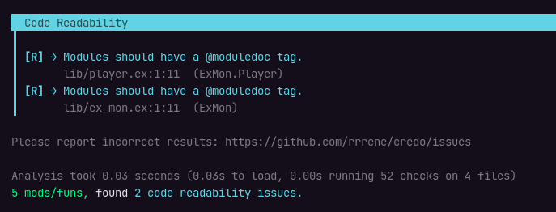
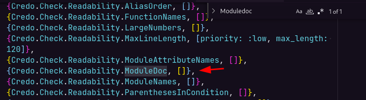

# Biblioteca Credo

O Credo é uma bilioteca para Elixir, é uma ferramenta de análise de código estático que faz a função de um Linter, e isso nos ajudará a manter a consistência do código de acordo com as boas práticas e padrões da comunidade.

## Adicionando Bibliotecas

Para adicionar uma biblioteca externa no projeto basta entrar no arquivo `/mix.exs` e editar o campo `deps` adicionando as informações da lib obtida no GitHub dela:

```elixir
defp deps do
  [
    {:credo, "~> 1.6", only: [:dev, :test], runtime: false}
  ]
end
```

Agora execute o comando abaixo na raiz do projeto para instalar as dependências:

```sh
mix deps.get
```

## Como o Credo Funciona?

Utilizando o comando `mix credo`, o Credo fará uma análise em todo o código e mostrará através de warnings o que devemos melhorar no código.

No nosso caso como removemos os comentários de documentação do código, umas das melhorias que ele irá apontar será justamente essa:



Como neste projeto não vamos utilizar os comentários de documentação de fato, então podemos configurar o Credo através de um arquivo `.credo.exs` na raiz do projeto para ignorar esse warning, um exemplo desse arquivo pode ser obtido no próprio [GitHub da lib](https://github.com/rrrene/credo/blob/master/.credo.exs).

Neste arquivo procura a linha que contém a propriedade com `ModuleDoc`:



E edite o valor para `false`:

```elixir
{Credo.Check.Readability.ModuleDoc, false},
```

Uma outra configuração interessante é mudar o modo do Elixir para o modo estrito com `strict` para `true`:

```elixir
strict: true,
```

## Extensão VSCode

Extensão do Credo para VSCode para exibir os warnings enquanto está codando:

[Extensão VSCode](https://marketplace.visualstudio.com/items?itemName=pantajoe.vscode-elixir-credo)

## Referências

- [Credo](https://github.com/rrrene/credo)
