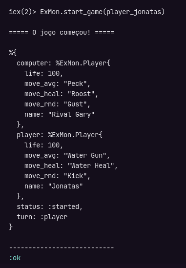

# Exibindo o estado do Jogo

Quando executamos o comando `ExMon.start_game(player)` a única coisa que aparece na terminal é a tupla de confirmação do processo criado pelo Agent, porém podemos exibir o estado do jogo ao invés disso, para não ficarmos sem visão. Para resolver isso, vamos criar um módulo responsável por exibir na tela o que está acontecendo no jogo a cada rodada.

Dentro do diretório `/lib` crie mais um diretório chamado `game` e um arquivo dentro dele chamado `status.ex`, este módulo vai ficar num diretório específico porque como queremos imprimir um status do jogo, faz sentido ele possui o namespace de "game".

Este método vai retornar uma mensagem de ínicio do jogo e o estado atual do jogo, que podemos conseguir com o módulo `ExMon.Game()`. O método `IO.inspect()` está sendo usado no segundo caso porque o retorno da informação terá as Structs dos players e o método `IO.puts()` não conseguiria imprimi-lo.

Au utilizar o `IO.inspect()` será impresso o valor de `Game.info()` e na sequência será exibido no terminal o retorno dessse método, ou seja, vai exibir duplicado, para não ter redundância podemos separar as linhas dos print com outro `IO.puts()`:

```elixir
defmodule ExMon.Game.Status do
  alias ExMon.Game

  def print_round_message do
    IO.puts("\n===== O jogo começou! =====\n")
    IO.inspect(Game.info())
    IO.puts("\n---------------------------")
  end
end
```

Agora ao rodar o comando `ExMon.start_game(player)`, será exibido o retorno do estado do jogo:



## Referências

- [When to Use Elixir’s IO.Puts and When IO.Inspect - Medium](https://medium.com/@timotejfartek/when-to-use-elixirs-io-puts-and-when-io-inspect-6eb005d80d90)
