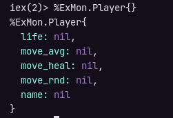
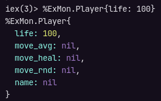
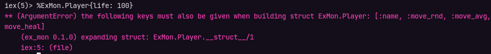
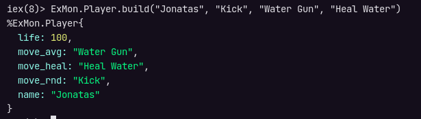

# Criando Players com Struct

Para representar os players, vamos utilizar uma estrutura de dados chamada `Struct`, trata-se de um tipo especial de `map` com chaves e valores padrões. O Struct deve ser criado dentro de um módulo com o seu mesmo nome.

Lembrando que os requisitos que definem um Player são:

- Cada player começa com 100 de vida.
- Ataque Moderado (18 à 25 pontos).
- Ataque Variado (10 à 35 pontos).
- Poder de cura (18 à 25 de vida).
- O Player humano pode escolher o seu nome e nomes dos movimentos.

> É comum um Struct ser a única coisa definida em um módulo.

Crie um arquivo chamado `player.ex` no diretório `/lib`, e monte a estrutura básica de um módulo:

```elixir
defmodule ExMon.Player do
  # code
end
```

> Não é obrigatório, mas vamos colocar o nome do projeto antes do nome do módulo para melhor organização.

## Criando um Struct

Para criar um Struct nós usamos o comando `defstruct` seguido de uma lista de palavra-chave com campos e valores padrões:

```elixir
defmodule ExMon.Player do
  defstruct [:life, :name, :move_rnd, :move_avg, :move_heal]
end
```

Para rodar o `IEX` dentro do projeto, entre no diretório raiz e utilize o comando:

```sh
iex -S mix
```

Podemos confirmar que o módulo existe digitando o nome do projeto mais o nome do arquivo:

```sh
ExMon.Player
```

E para confirmar o funcionamento da Struct, rode o comando abaixo que exibirá a Struct na tela:

```elixir
%ExMon.Player{}
```



Se reparar, o Struct tem a mesma estrutura de um `map`, mas diferente dele, possui um nome que o identifica e chaves pré definidas. Para criar uma "instância" do player, podemos colocar os valores na chave `{}`:

```elixir
%ExMon.Player{life: 100}
```



Porém como vimos, é possivel criar um Struct sem preencher todos os valores, para tornar as chaves obrigatórias ulizamos o comando `@enforce_keys` passando as chaves desejadas:

```elixir
defmodule ExMon.Player do
  @enforce_keys [:life, :name, :move_rnd, :move_avg, :move_heal]
  defstruct [:life, :name, :move_rnd, :move_avg, :move_heal]
end
```

Recompile o projeto com:

```sh
recompile
```

Agora ao tentar criar um Struct só com um valor, o Elixir exibirá um erro:



## Criando métodos

O valor da chave `life` sempre começará com 100, então neste caso, podemos criar um método para receber como parâmetro apenas os valores que precisarão ser inserido de fato.

Quando o usuário chamar a função `build()`, vamos retornar um Struct de Player, então podemos chamar este método passando os argumentos na ordem:

```elixir
ExMon.Player.build("Jonatas", "Kick", "Water Gun", "Heal Water")
```

> O método deve inicar com letra mínuscula.

Deste modo, o Player será criado já com o chave `life` preenchida:



Como estamos repetindo código, podemos colocar a lista com as chaves em uma variável `required_keys` para reaproveitá-la:

```elixir
defmodule ExMon.Player do
  required_keys = [:life, :name, :move_rnd, :move_avg, :move_heal]

  @enforce_keys required_keys

  defstruct required_keys

  # code ...
end
```

Para evitar chumbar o valor `100` na chave `life`, podemos utilizar variáveis de módulo como constantes, para isso utilize a keyword `@` seguido do nome e valor, vamos aproveitar para tornar a variável `required_keys` em uma constante de módulo também e trocar os valores para ordem alfabética (apenas por boa prática):

```Elixir
defmodule ExMon.Player do
  @required_keys [:life, :move_avg, :move_heal, :move_rnd, :name]
  @max_life 100

  @enforce_keys @required_keys

  defstruct @required_keys

  def build(name, move_rnd, move_avg, move_heal) do
    %ExMon.Player{
      life: @max_life,
      move_avg: move_avg,
      move_heal: move_heal,
      move_rnd: move_rnd,
      name: name
    }
  end
end
```

Agora no nosso módulo principal no arquivo `ex_mon.ex`, vamos utilizar uma função que cria o jogador, a partir dessa estrutura básica:

```elixir
defmodule ExMon do
  def create_player(name, move_rnd, move_avg, move_heal) do
    ExMon.Player.build(name, move_rnd, move_avg, move_heal)
  end
end
```

Agora ao invés de chamar a Struc no `IEX`, podemos chamar o método principal:

```sh
ExMon.create_player("Jonatas", "Kick", "Water Gun", "Heal Water")
```

Quando temos nomes do módulos compostos como `ExMon.Player`, podemos simplificar eles criando alias, dessa forma somente o último nome será utilizado no código, deixando mais limpo:

```elixir
defmodule ExMon do
  alias ExMon.Player

  def create_player(name, move_rnd, move_avg, move_heal) do
    Player.build(name, move_rnd, move_avg, move_heal)
  end
end
```

E ainda se quisesse poderia renomear o módulo importado com qualquer outro nome:

```elixir
defmodule ExMon do
  alias ExMon.Player, as: Banana

  def create_player(name, move_rnd, move_avg, move_heal) do
    Banana.build(name, move_rnd, move_avg, move_heal)
  end
end
```

## Referências

- [Struct - Elixir School](https://elixirschool.com/pt/lessons/basics/modules#structs-2)
- [Struct](https://elixir-lang.org/getting-started/structs.html)
