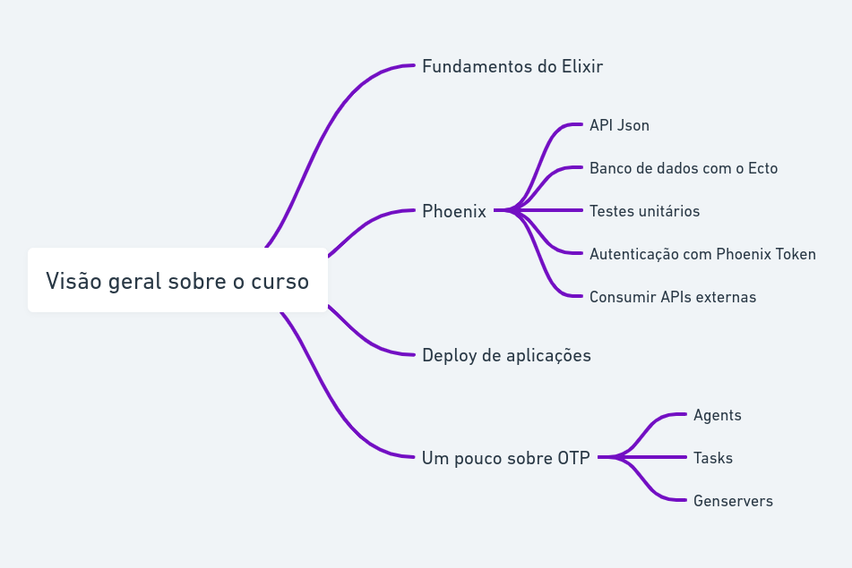

# Elixir e Phoenix do Zero

## Sumário

### Seção 1 - Fundamentos do Elixir

- [Por que estudar Elixir e Programação Funcional?](1-fundamentos/por-que-elixir.md)
- [Instalando o Erlang/Elixir](1-fundamentos/instalacao.md)
- [IEX](1-fundamentos/iex.md)
- [Tipos Básicos](1-fundamentos/tipos-basicos.md)
- [Imutabilidade](1-fundamentos/imutabilidade.md)
- [Listas](1-fundamentos/listas.md)
- [Tuplas](1-fundamentos/tuplas.md)
- [Keyword](1-fundamentos/keyword.md)
- [Map](1-fundamentos/maps.md)
- [Enum](1-fundamentos/enum.md)
- [Pattern Matching](1-fundamentos/pattern-matching.md)
- [Operador Pipe](1-fundamentos/pipe-operator.md)

## Links úteis

- [Visão geral do curso](https://whimsical.com/boas-vindas-ao-curso-elixir-e-phoenix-do-zero-SsRo16x4Za2EGy4VbjjirE)
